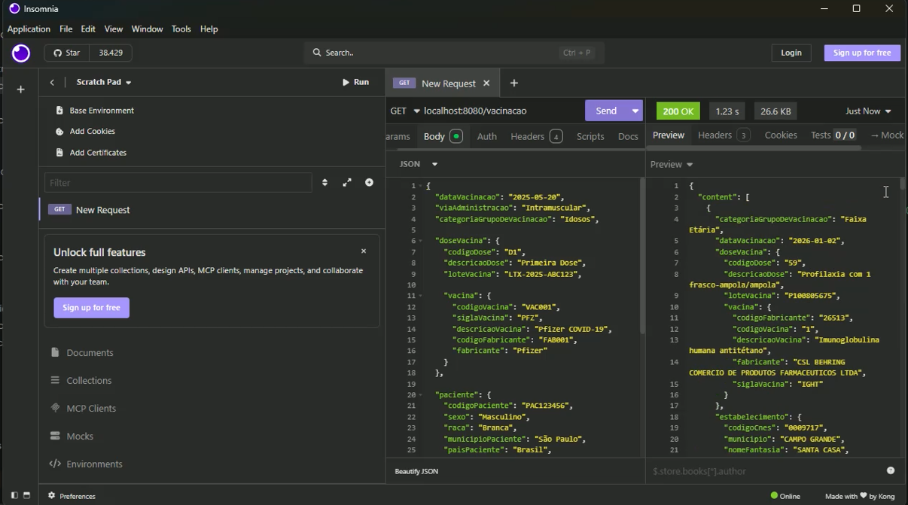
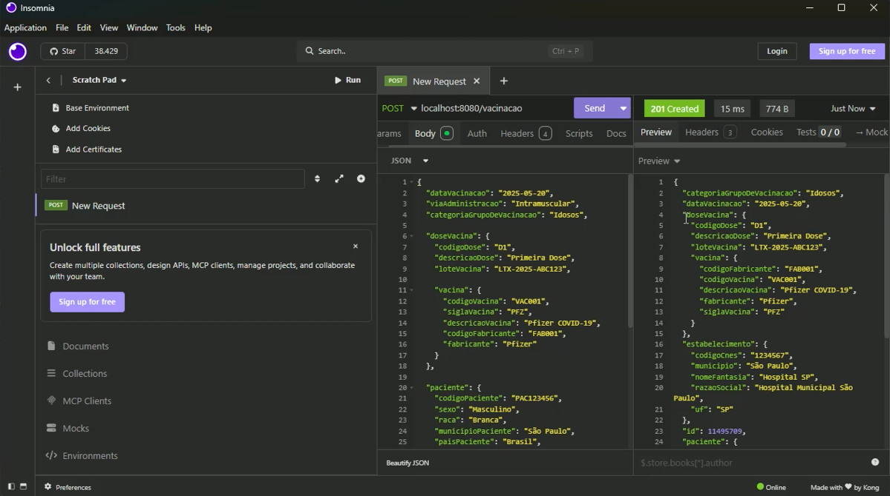
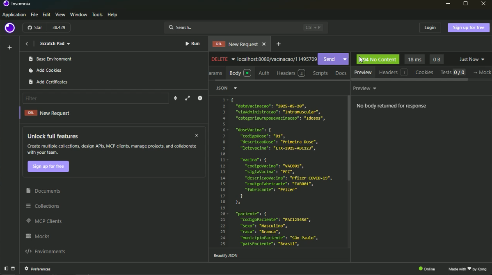
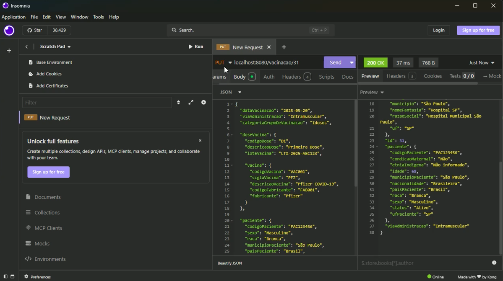
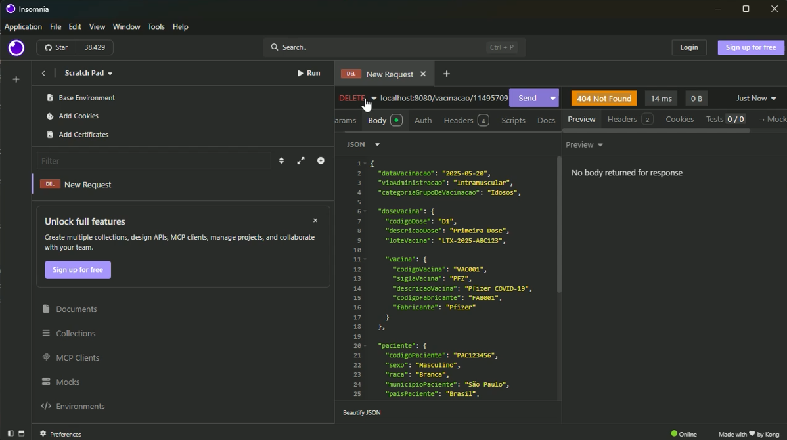

Projeto prático desenvolvido para a disciplina da Profa. Sirley Ambrosia Vitorio Addão, com o objetivo de criar uma aplicação Full Stack (Java + React) para consultar e analisar dados de cobertura vacinal, disponibilizados pelo SUS.

## Tecnologias e Requisitos Técnicos

**Backend (API REST):**
* **Java 21**
* **Spring Boot 4.0.6** (WebMVC, Data JPA)
* **MySQL** (Banco de dados principal)
* **OpenCSV 5.9** (Para leitura e importação da carga inicial de dados reais)

**Frontend:**
* **React.js**
* **Axios** (Integração HTTP)

## Como Executar o Projeto

### Pré-requisitos
* Java JDK 21 instalado.
* Node.js instalado.
* Servidor MySQL rodando na máquina

### Passo 1: Rodando a API (Backend)
1. Clone este repositório.
2. Abra a pasta do backend na sua IDE (IntelliJ, Eclipse, VS Code).
3. Atualize as dependências do Maven (o arquivo `pom.xml` já contém tudo o que é necessário).
4. Insira o arquivo csv em: /api-imunidata-src/main/resources/dados/vacinacoes.csv`
5. Configure as credenciais do seu banco de dados MySQL no arquivo `/api-imunidata-src/main/resources/application.properties`:
   
```properties
   spring.datasource.url=jdbc:mysql://localhost:3306/imunidata
   spring.datasource.username=seu_usuario
   spring.datasource.password=sua_senha

6. Execute o programa na porta 8080, através do main em sua IDE de escolha.


### Passo 2: Rodando o Frontend

1. Abra a pasta do projeto frontend.
2. Execute no terminal: npm install para instalar as dependências.
3. Execute: npm start, para rodar o projeto.


Abaixo estão os endpoints disponíveis na nossa API RESTful:

| Método HTTP | Rota | Descrição |
| :--- | :--- | :--- |
| `GET` | `/vacinacao` | Lista todos os registros com suporte a paginação e filtros de busca dinâmica (estado, faixaEtaria, vacina). |
| `GET` | `/vacinacao/{id}` | Busca um registro específico pelo seu ID (Retorna Status 200 OK ou 404 Not Found). |
| `POST` | `/vacinacao` | Cadastra um novo registro de vacinação (Retorna Status 201 Created). |
| `PUT` | `/vacinacao/{id}` | Edita os dados de um registro existente. |
| `DELETE` | `/vacinacao/{id}` | Exclui um registro de vacinação do sistema (Retorna Status 204 No Content). |
| `GET` | `/vacinacao/dashboard/contagem` | Retorna o número numérico total de registros no banco. |
| `GET` | `/vacinacao/dashboard/contagem/uf` | Retorna um mapa consolidado de aplicações agrupadas por UF. |

## O uso do Optional

No ecossistema Java e Spring Boot, utilizamos a classe Optional (introduzida no Java 8) como uma boa prática, especialmente no retorno de métodos de busca do repositório, como o `findById()`.
Ele evita a interrupção abrupta do sistema pela famigerada exceção `NullPointerException`. Em vez de o Spring retornar um objeto `null` cru quando um ID buscado não existe no banco de dados, o Optional atua como um "contêiner" que encapsula o resultado, facilitando o tratamento de erros e permitindo devolver um Status HTTP amigável (como o 404 Not Found) de forma limpa, segura e sem "quebrar" a aplicação.

## Prints do Insomnia
Get:

Post:

Delete

PUT

Erro 404:

